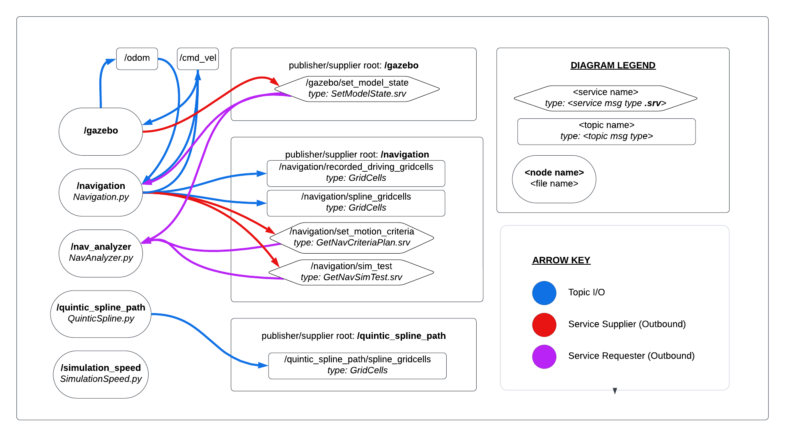

# **ROS Spline Path Motion Profiling**

## Introduction:

 A great part of robotics is control algorithms for autonomous driving. One well known method for autonomous driving is path planning along spline curves. 
 
 This has been done with various methods that involve interpolating curved paths between specified waypoint locations of which the path intersects. Many of these ways are B-splines and Bezier curves to name a couple. B-splines refer to a broad range of polynomial relationships that compute interpolated positions on a flat plane surface as many types of curved paths. This kind of geometry offers great flexibility by allowing for paths to be created from subtle and fine-tuned changes in heading for a robot driving through all interpolated points tangentially to the curve. 
 More specifically, quintic splines were implemented within the context of this project. This allows for a robot to autonomously drive a well-controlled path through specified waypoints in a similar way as if it were teleoperated. 

To further control the accuracy and smoothness of autonomous driving, motion profiling wheel speeds across a computed spline curve path will allow a robot to accelerate and decelerate at predictable speeds. Motion profiling was considered with the criteria of a fixed acceleration, maximum linear speed, maximum angular speed, and a maximum centripetal acceleration. Combining this specific motion profiling criteria with quintic splines allows for a strong autonomous control algorithm. 

Finally, although well-tuned precision on calculated wheel speeds is required for proper path following that both quintic spline path planning and motion profiling provide, a robot is still prone to drift from its own path. To address this, simply telling the robot what speeds to use and when for as it drives along a path is not enough on its own, but a means to measure inaccuracies in path following should be considered to proportionally adjust wheel speeds accordingly. This can serve as an overlay differential speeds on top of the motion profile to nudge the robot back onto course as a feedback system that responds based on its active environment. Given the robot is programmed to required specified linear and angular speeds, a linear and angular speed PID controller can be used to provide feedback. Such as system can then be manually or automatically tuned. 

Combining all of these concepts, the benefits of gradually-adjusted curved spline paths to be followed with a motion profiling overlaid by a PID feedback system allows for controlled motion with auto-corrective behavior for differential drive robots. This idea is explored in this project as spline path motion profiling with PID feedback for a ROS turtlebot3 test apparatus. 

## Project Hierarchy:
This project consists of a simulating spline path following on a turtlebot3 in ROS. This is done within a configured Gazebo/RViz environment with the following ROS package architecture. 

 

 